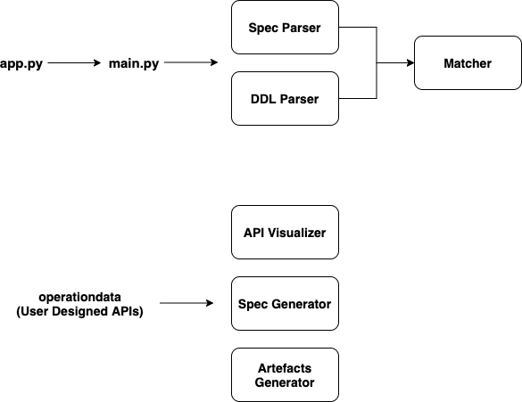

# EzAPI Intelligent Miner

This Project is a core module for designing APIs through the EzAPI platform. It's built on top of OpenAPI specification with Python, Flask, MongoDB, and with a lot of love!

## Prerequisites

1. Python 3.7.x or higher
2. MongoDB

## Project Setup

Note: These instructions are for macOS and Linux.

1. Install virtualenv if not installed:

```bash
python -m pip install --user virtualenv
```

2. Setup a virtualenv:

```bash
python -m virtualenv venv
source ./venv/bin/activate
pip install -r REQUIREMENTS.txt
```

3. MongoDB if running locally 
4. Start the Flask server
```bash
python app.py
```

Open the browser and go to [http://127.0.0.1:5000/](http://127.0.0.1:5000/). You'll see a default homepage

## Design Principal
The entire EzAPI Intelligent Miner consists of 4 components - 

1. Parser
2. Matcher
3. API visualizer and Spec Generation
4. Artefacts Generation

### Parser - 
*The parser is used for parsing an input file into a structured format, which can be further used for all the processing. There are Spec and DDL Parser exists.*

###### 1. Spec Parser - Parsing an original OpenAPI/Swagger JSON file and storing the data into numerous collections 

```python
- /spec_parser/parser_init.py - The init module for the parser, which checks the spec version and calls the specific parser
- /spec_parser/openapi_parser.py - Parser for OpenAPI v3.0.0 or above
- /spec_parser/swagger_parser.py - Parser for Swagger v2.x
```

###### 2. DDL Parser - Parsing a SQL DDL file (SQL Server for now) and persisting into DB 

```python
- /ddl_parser/parser_init.py - The init module for the DDL parser, which parses all the tables, columns, and data types
- /ddl_parser/dtmapper.py - Maps the column Data Type into OpenAPI Data Type and Format
```

collections - 
* **raw_spec** - Raw Spec Data
* **paths** - Path Data for a Spec including both request and response structure
* **components** ​- Components Data from Spec
* **parameters** - Extracting all the parameters only
* **schemas** - Extracting Direct Schemas with their size
* **tables** - Parsed Tables and Columns Data


### Matcher
*The matcher is a mapping from Spec Schema to Tables and their attributes. It returns all the attributes that are matching and their percentage score. Which can be further used for automatic code generation*

```python
- /matcher/matcher_init.py - The matching module
```

collections - 
* **matcher** - Matched data b/w Spec and Table Attributes

### API visualizer and Spec Generation
*This application is used to visualize a Sankey diagram of user-designed APIs and generating the corresponding OpenAPI 3.0.0 specification*

###### 1. Visualizer - Extracting request elements and visualizing them into the Sankey network flow

```python
- /visualizer/element_scoring.py - Extracting level 0 request parameters and body attributes
- /visualizer/sankey.py - Store Sankey graph data in the form of nodes and links between nodes.
```

###### 2. Spec Generation - Generating the OpenAPI spec

```python
- /spec_generator/generator_init.py - The init module for Spec generator and spec generation for spec-based project flow
- /spec_generator/generate_db_only.py - Spec generation for DB only flow
```

collections - 
* **elements** - Extracted Level 0 elements
* **sankey** - Sankey Flow JSON structure
* **genspec** - Generated OpenAPI Specification

### Artefacts Generation
*This module generates testcase data for all the endpoints and the corresponding response status code*

```python
- /artefacts/artefacts_init.py - The init module for testcase generation
- /artefacts/ezfaker.py - Generating the payload data, built on top of python faker library
- /artefacts/reverse_regex.py - To generate text data matching a particular regex pattern
```

### Other Files - 
```python
- config.py - Config file for database connection and storing mechanism
- main.py - Main file which imports all submodules and creates EzAPIModels object
- /utils/common.py - Common library for the application
- /utils/schema_manager.py - Common library for schema related function (e.g. size of a schema, dereferencing a schema)
```

collections - 
* **testcases** - List of all testcases
* **test_result** - Test results for future refernece
* **virtual** - Similar to testcases with required only fields

## Project Flow - 
